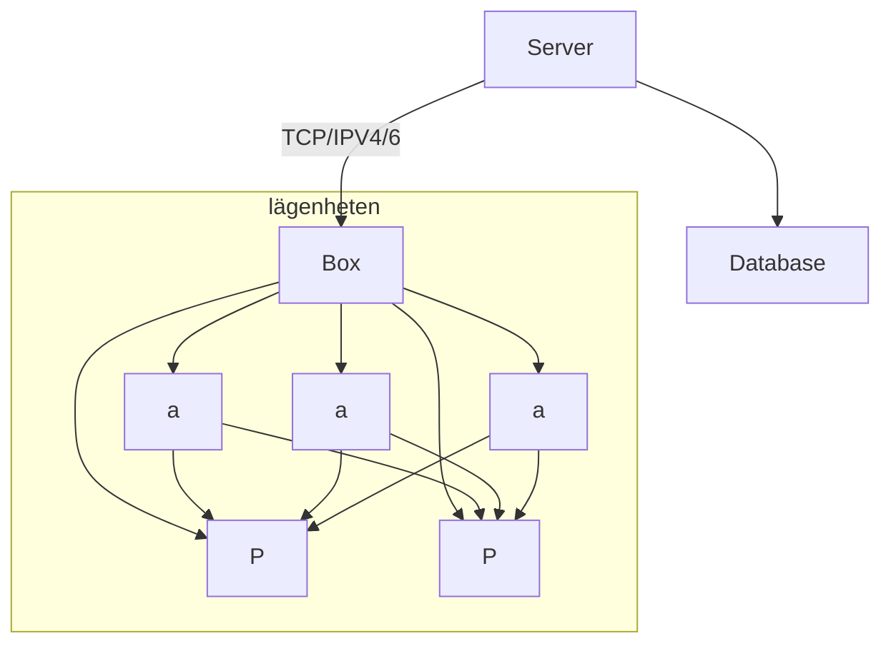

# iot_arch_project1

For our 3-month long IoT Architecture course at Jensen YH (2025)  
We are 8 members.  
### Stockholm:
* Carl Blumenthal (Rackhamn)
* Mojtaba Mohseni (xxx)
* Swathi xxx (yyy)
* Gabriel xxx (yyy)
### Malmö:
* Anton Gobbert (pankakan)
* Martin af Uhr (stormtomten)
* Kerry xxx (yyy)
* Denize S. (QueDe)

# Project Information
Information about the project.  
  
## Plan
Meeting 1: 2025-01-21, 17:00
More meeting times etc...
  
## Details
Plans and details to follow
  
## Resources
[Link Example](http://google.com)  
[Github .md helper](https://gist.github.com/allysonsilva/85fff14a22bbdf55485be947566cc09e)  

