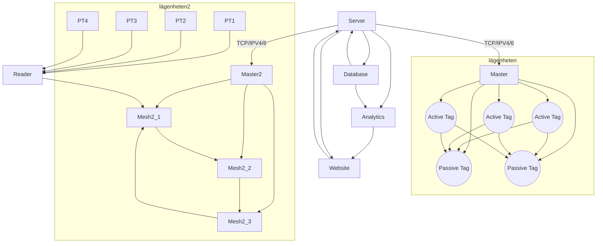
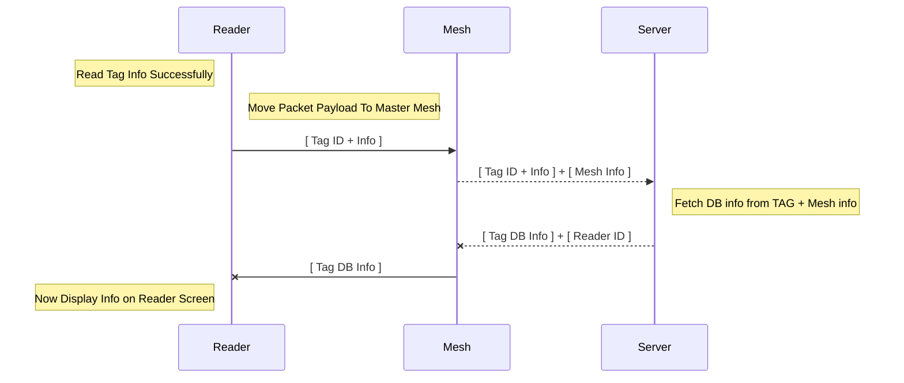
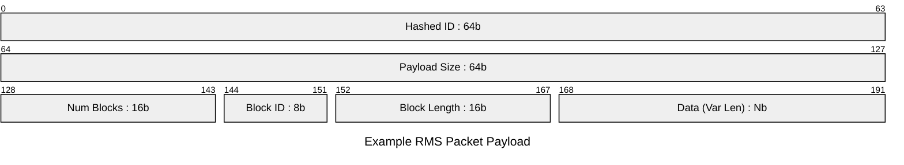

# iot_arch_project1

For our 3-month long IoT Architecture course at Jensen YH (2025)  
We are 7 members.  
### Stockholm:
* Carl Blumenthal (Rackhamn)
* Mojtaba Mohseni (Mohsen-png)
* Swathi xxx (swati72-t2)
* Gabriel xxx (Gabbemannen00)
### Malmö:
* Martin af Uhr (stormtomten)
* Kerry xxx (yyy)
* Denize S. (Que-ctrl)

# Project Information
_Designing a system assisting housekeeping and supervisors with post-checkout control for short-term apartment rentals._
  
## Plan
Initial Meeting: 2025-01-21, 17:00 _done_    
Meeting log: https://docs.google.com/document/d/1dKvJOzCxKPIAF0xGJFeyn81T_Q298DL61lQWgLDmnBw/edit?usp=sharing  

### Basic Architecture Idea:  
A main server with a database + user website.  
A Mesh network of pico connected active RFID tags. 
It should configure itself and choose one as Master (that interacts with the server and runs commands)   
A set of passive RFID tags read by the mesh network.  
A Reader/Writer pair for RFID tags.  

Update:  
We are going to have to change our original architecture idea slightly.  
Instead of having an active RF reader in every room that communicates with the RFID tags, we are going to have a RFID reader module that a person can use to scan all the tags in a room.  
Each read will be sent through our mesh network that in turn speaks to the server.

It might be best to have a split architecture.  
One with the basic passive RFID tags where we use a reader module.  
One with the active RFID tags that we try to read once every N seconds. Need to find a working antenna though + think about power consumtion.  
  
## Details
Plans and details to follow
  
## Resources
[Link Example](http://google.com)  
[Github .md helper](https://gist.github.com/allysonsilva/85fff14a22bbdf55485be947566cc09e)  

### TODO:  
  Server-Master Sequence Diagram  
  Mesh Sequence Diagram  

### Basic Handheld Reader - Mesh - Server (RMS) Sequence

### First Approximation of RMS Packet Payload

### Initial Whiteboard Sketch

