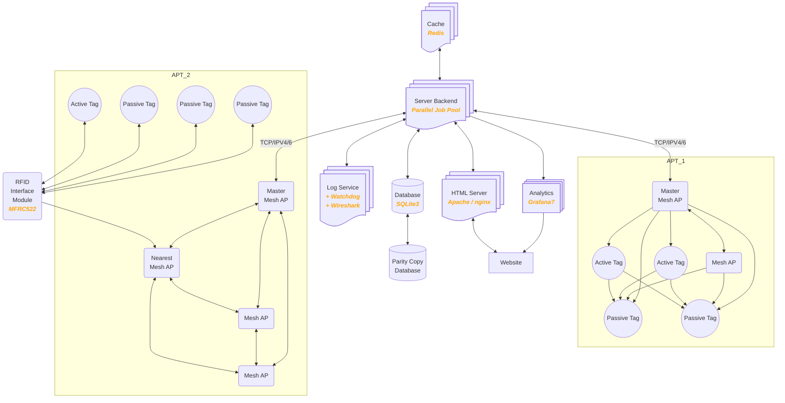
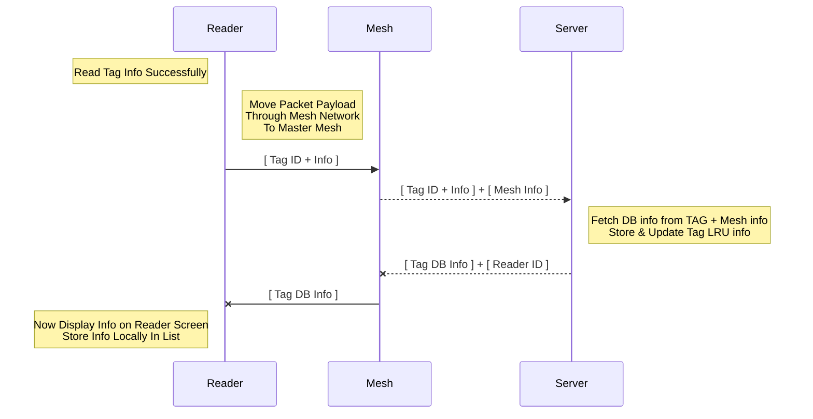
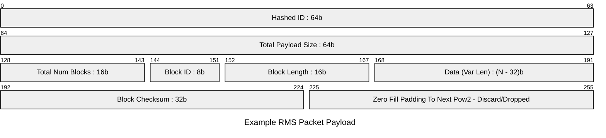
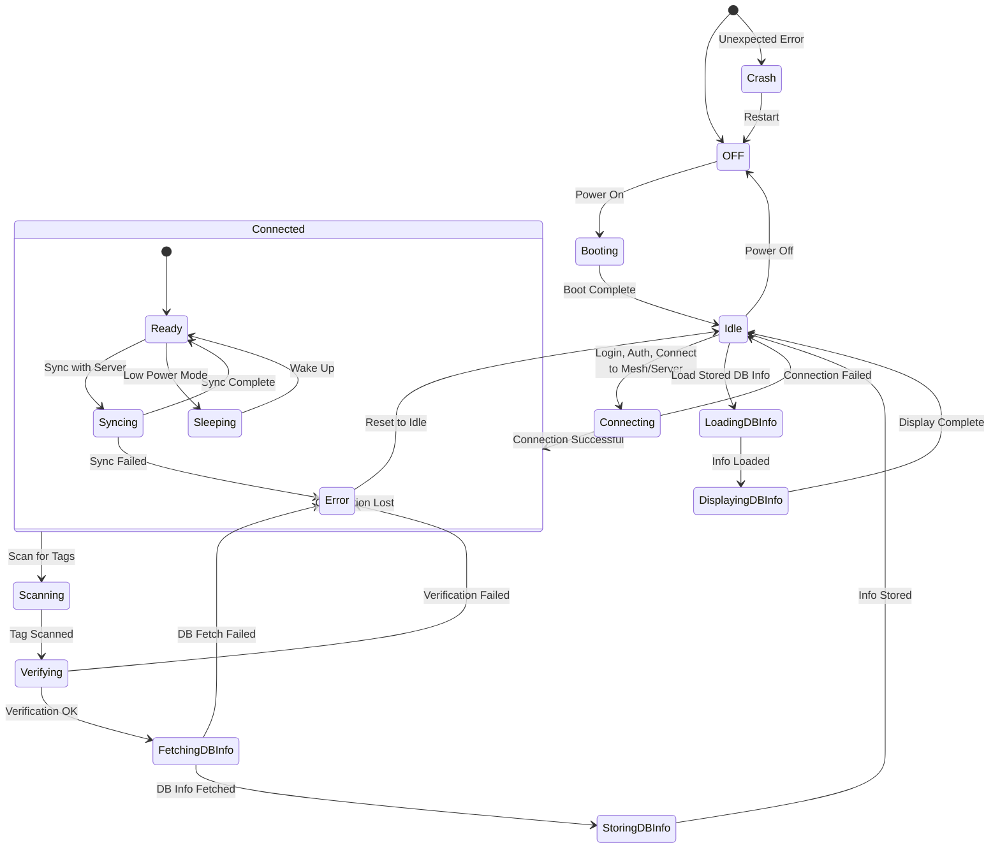

# JATS - Jensen Asset Tracking Solution

For our 3-month long IoT Architecture course at Jensen YH (2025)  
We are 7 members.  
### Stockholm:
* Carl Blumenthal (Rackhamn)
* Mojtaba Mohseni (Mohsen-png)
* Swathi xxx (swati72-t2)
* Gabriel xxx (Gabbemannen00)
### Malmö:
* Martin af Uhr (stormtomten)
* Kerry xxx (yyy)
* Denize S. (Que-ctrl)

# Project Information
_Designing a system assisting housekeeping and supervisors with post-checkout control for short-term apartment rentals._
  
## Plan
Initial Meeting: 2025-01-21, 17:00 _done_    
Meeting log: https://docs.google.com/document/d/1dKvJOzCxKPIAF0xGJFeyn81T_Q298DL61lQWgLDmnBw/edit?usp=sharing  

### Basic Architecture Idea:  
A main server with a database + user website.  
A Mesh network of pico connected active RFID tags. 
It should configure itself and choose one as Master (that interacts with the server and runs commands)   
A set of passive RFID tags read by the mesh network.  
A Reader/Writer pair for RFID tags.  


### Update:  
_We are going to have to change our original architecture idea slightly._ :thinking:
_Instead of having an active RF reader in every room that communicates with the RFID tags, we are going to have a RFID reader module that a person can use to scan all the tags in a room._
_Each read will be sent through our mesh network that in turn speaks to the server._

_It might be best to have a split architecture._  
_One with the basic passive RFID tags where we use a reader module._  
_One with the active RFID tags that we try to read once every N seconds. Need to find a working antenna though + think about power consumtion._  
  
## Details
Plans and details to follow :smiley:
  
## Resources
[Link Example](http://google.com)  
[Github .md helper](https://gist.github.com/allysonsilva/85fff14a22bbdf55485be947566cc09e)  
  
<br/><br/><br/><br/>
  
### Architecture Diagrams:  



<br/><br/>
---  

### Basic Handheld Reader - Mesh - Server (RMS) Sequence


<br/><br/>
### First Approximation of RMS Packet Payload
```basic
0      64     128    144    152    168    192    225    255
[ hid  | tps  | tnb  [ blid | size | data | crc  ] zpad ]
```




<br/><br/>
---  

### RFID Reader States
&nbsp;&nbsp;&nbsp;&nbsp;_plz reduce complexity here_  



<br/><br/>

---  

### Initial Whiteboard Sketch

