# JATS - Jensen Asset Tracking Solution

For a two part and 3-month long IoT Architecture course at Jensen YH (2025)  

# Background  
We were tasked with designing and implementing a IoT and Embedded system.  
As a group we ended up choosing to create an asset tracking system based on rfid tags.  
The goal of the system was to help small hotels, apartments and similar accomodations to keep track of their assets after every checkout.  

In short, we stated the goal as the following:  
* ```Designing a system assisting housekeeping and supervisors with post-checkout control for short-term apartment rentals.```
  
Each contributor had their own directory for pushing their specific codes and tests.  
That directory is ```/RnD/$username```  
The plan was that the final build would be combined and placed into ```/src/```, altough, that did not end up happening.  
  
### Basic Architecture Idea:   
A main server with a database + user website.  
A Mesh network of pico connected active RFID tags.  
It should configure itself and choose one as Master (that interacts with the server and runs commands)   
A set of passive RFID tags read by the mesh network.  
A Reader/Writer pair for RFID tags.  
  
### Pictures of the final design and solution:  
* put pictures here
  
## Failures and lessons:  
All of our planned features did not make it into the codebase before the final day.  
We did not get the implement a custom mesh network, add discrepancies and automatic logging or database backups...  
We learned a little too late that the SQLite database was not suited for multi-threaded and multi-connection reads and writes at the same time for our development machine (running linux).  
  
We did get to implement the system in both Python and in C.  
We got to build drivers for LCD display and NFC/RFID readers.  
We got to use the WiFi capability of the Pico W and connect over TCP to multiple handmade servers (C) and a flask server (Python).  
We did (somewhat begrudgingly) got to work with JS, HTML and other Web frontends while with working on out HTTP server (C).  
  
Because we used a per-contributor folder for their own code we had difficulty moving everything into the ```/src/``` directory properly.  
Perhaps it would have been a lot easier if we did not separete the development in such a way, but instead had used a single monorepo with a directory for each feature or something similar...  
  
Even with the loss of 4 out of 7 of the original team, the rest of the team managed to pull together and get *really* close to a fully functional build before the final.  
If we had had one more working day (about 4-8 hours), the team believes that the project would have been able to launch as a real product. (Or could *atleast* be treated as a closed beta)  

  
<br/><br/><br/><br/>

# Here follows multiple designs and architecture mockups made for this specific system.

### Simplex Example
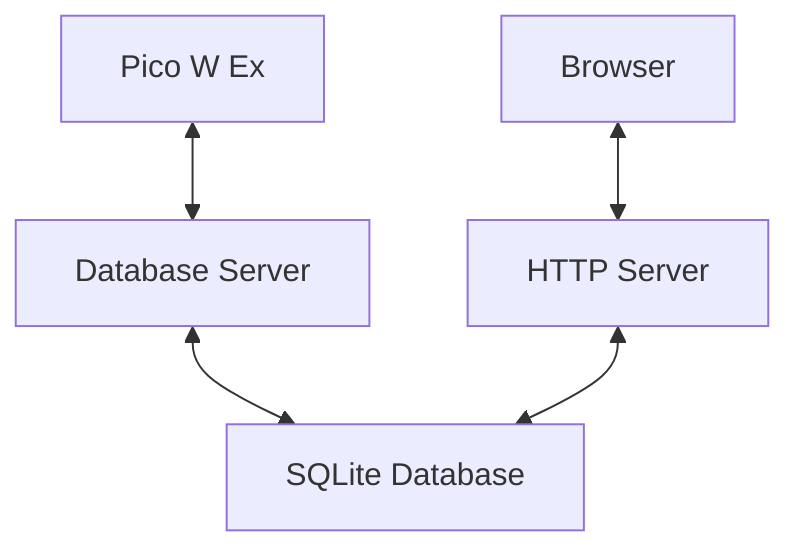
  
## Architecture Diagrams:  
### Architecture For Server Diagrams:  
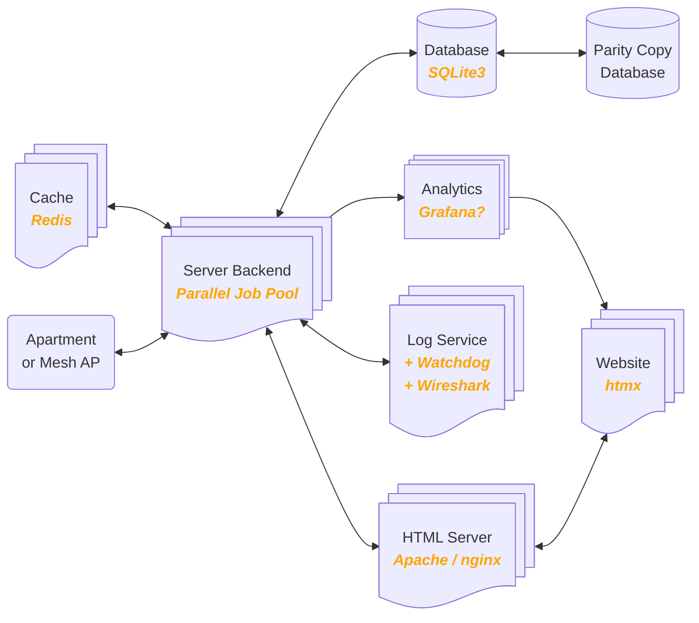
<br/><br/>
---  

### Architecture For Apartments Diagrams:  
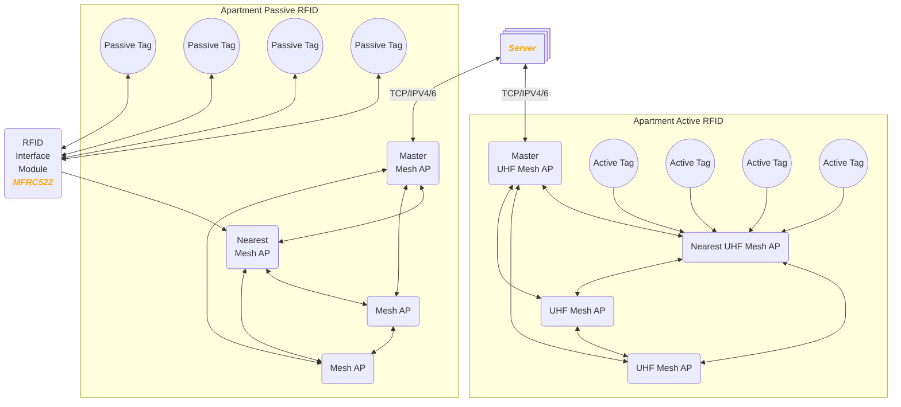


<br/><br/>
---  

### Basic Handheld Reader - Mesh - Server (RMS) Sequence
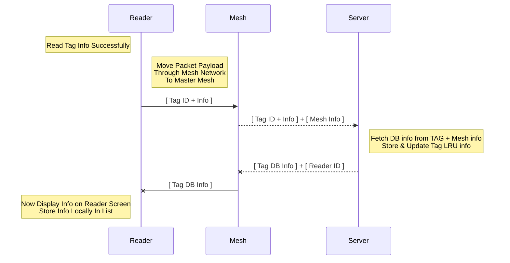

<br/><br/>
---  

<br/><br/>
### First Approximation of RMS Packet Payload
```c
0      64     128    144    152    168    192    225    255
[ hid  | tps  | tnb  [ blid | size | data | crc  ] zpad ]

/*
  64b := the max size of an integer is 64 bits (or 8 bytes)
  this means the following ranges:
    signed min:    -9,223,372,036,854,775,808         (-2^63)
    signed max:     9,223,372,036,854,775,807         (2^63 - 1)
    unsigned min:   0
    unsigned max:   18,446,744,073,709,551,615        (2^64 - 1)
*/

struct rms_block_64b_s {
  uint8_t     id;
  uint16_t    size;
  uint8_t *   data;
  uint32_t    crc32;
};
typedef struct rms_block_64b_s block_t;

struct rms_payload_64b_s {
  uint64_t    hash_id;
  uint64_t    size; // payload_size_bytes
  uint16_t    num_blocks;
  block_t *   blocks;
  uint8_t *   zero_padding;
};
typedef struct rms_payload_64b_s payload_t;
```


---  

```c
0      32     64     72     80     96     128    160    192
[ hid  | tps  | tnb  [ blid | size | data | crc  ] zpad ]

/*
  32b := the max size of an integer is 32 bits (or 4 bytes)
  this means the following ranges:
    signed min:    -2,147,483,648                     (-2^31)
    signed max:     2,147,483,647                     (2^31 - 1)
    unsigned min:   0
    unsigned max:   4,294,967,295                     (2^32 - 1)
*/

struct rms_block_32b_s {
  uint8_t     id;
  uint16_t    size;
  uint8_t *   data;
  uint32_t    crc32;
};
typedef struct rms_block_32b_s block_t;

struct rms_payload_32b_s {
  uint32_t    hash_id;
  uint32_t    size; // payload_size_bytes
  uint8_t     num_blocks;
  block_t *   blocks;
  uint8_t *   zero_padding;
};
typedef struct rms_payload_32b_s payload_t;
```

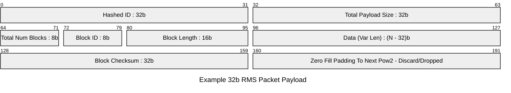

<br/><br/>

## RFID Reader Communication Layout
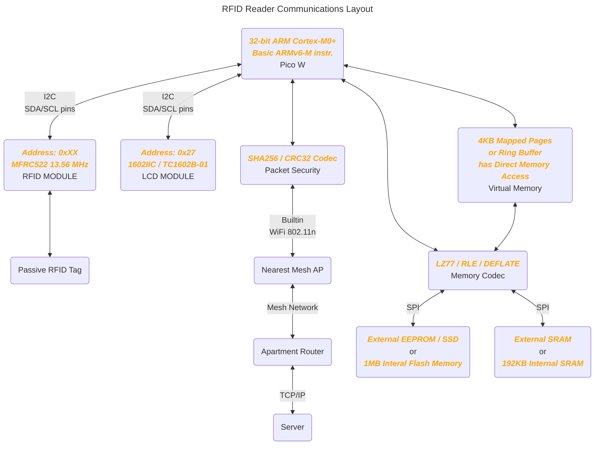

### RFID Reader States
&nbsp;&nbsp;&nbsp;&nbsp;_plz reduce complexity here_  

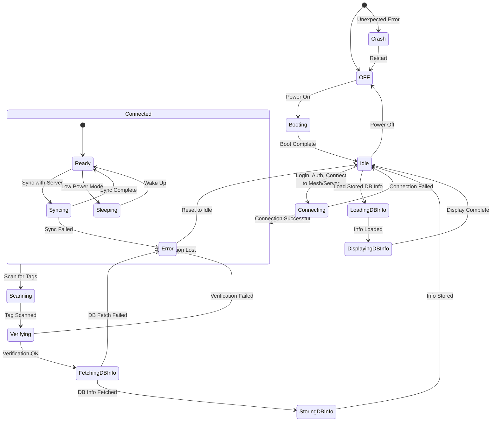

<br/><br/>

## Mesh Network Configuration Sequence
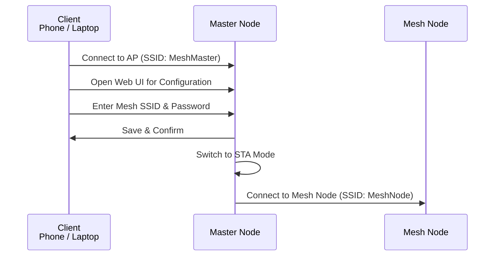

## Mesh Network Communication Sequence
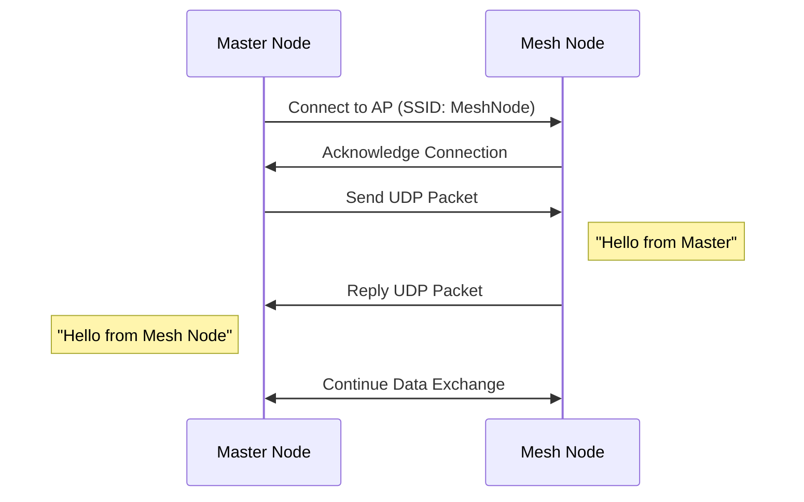

<br/><br/>


## Mesh Network Bootstrapping States
```mermaid
stateDiagram-v2
    direction LR

    [*] --> Init
    Init --> Scan_Mesh: Scan for Existing Mesh
    Scan_Mesh --> Join_Mesh: Found Existing Mesh
    Scan_Mesh --> Become_Master: No Mesh Found (Becomes Master)

    Become_Master --> Start_AP: Start AP Mode (Client Setup)
    Join_Mesh --> Connect_To_Master: Connect to Master Mesh Node
    Connect_To_Master --> Mesh_Ready: Start Mesh Communication

    Start_AP --> Wait_Client: Wait for Phone/Laptop Connection
    Wait_Client --> Web_Config: Host Web UI for Configuration
    Web_Config --> Setup_Complete: Save Settings
    Setup_Complete --> Mesh_Ready

    Mesh_Ready --> [*]
```

## Mesh Network Master State
```mermaid
stateDiagram-v2
    direction LR
    [*] --> Start_AP
    Start_AP --> Wait_Client: Wait for Phone/Laptop Connection
    Wait_Client --> Web_Config: Host Web UI (192.168.4.1)
    Web_Config --> Receive_Config: Receive Network Settings
    Receive_Config --> Save_Config: Save New Settings
    Save_Config --> Restart_Network: Restart with New Config
    Restart_Network --> Mesh_Ready
    Mesh_Ready --> [*]
```

## Note on the RFID Reader/Writer Modules
```
Model: HW-126, 
SDA    SCK    MOSI    MISO    IRQ    GND    RST    3.3V

Model: WPI405, TC-9927144, 
IRQ    NSS*    SCK    MOSI    MISO    GND     RST    VCC**
    *NSS=SDA
    **VCC=3.3V

---------------------

On IRQ:
IRQ is an optional pin. It does not have to be used or plugged in / connected.
However, if we don't want to poll continuously, we can use IRQ to help trigger events when tag is nearby.
This does require additional interrupt handling code.
Using the IRQ-pin can aid in battery life / power consumption.


IC Info:
    IC:     MF RC522
    RATE:   13.56 MHz
    COMM:   SPI
    POWER:  6 dBm (4 mW)
    DISTANCE: approx. 0 to 5cm

Passive Tags that work with the MFRC522:
Mifare S50, S70, Ultralight... (most of them i guess)


Pin Legend:
VCC    Voltage Common Collector    (Positive Voltage Supply)
GND    Ground
RST    Reset
SDA    Signal Data
SCK    Signal Clock
NSS    Slave Select            (Used as SDA in this case)
IRQ    Interrupt Request
MOSI   Master-Out-Slave-In
MISO   Master-In-Slave-Out

Datasheet links for MFRC522 chip (not the modules themselves):
2007: https://mm.digikey.com/Volume0/opasdata/d220001/medias/docus/60/CN0090%20DATASHEET.pdf
2016: https://cdn.velleman.eu/downloads/29/infosheets/mfrc522_datasheet.pdf
```

<br/><br/>

---  

### Initial Whiteboard Sketch

